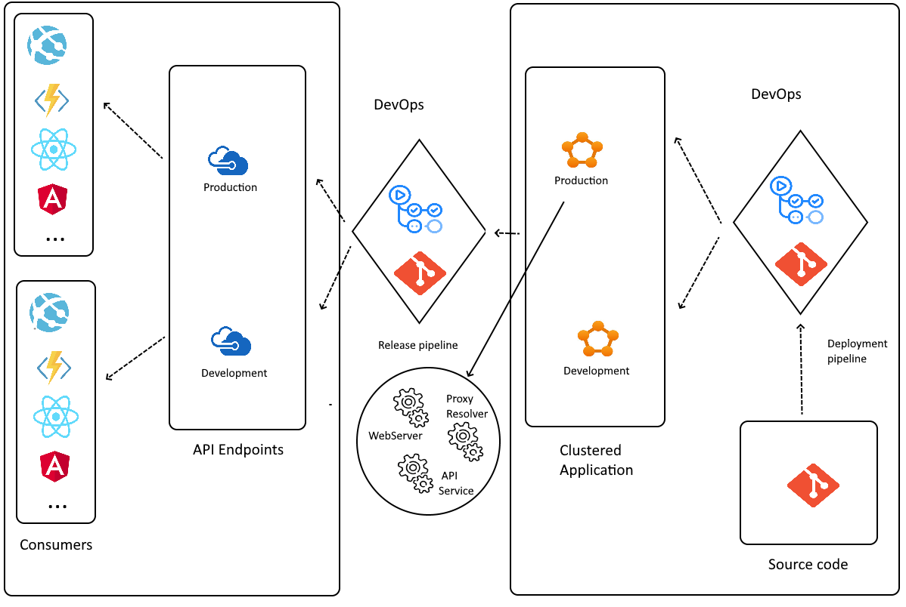

# SVASTHA
SVASTHA is a microservice-powered personal health journey dashboard. The technology behind the solution allows DevOps engineers to rollout and/or promote APIs across various environments at scale.

> This project is created as part of [Azure Innovation Challenge](https://innovationchallenge.devpost.com/)

# Data & Technology Used

- [Azure service fabric](https://azure.microsoft.com/en-us/services/service-fabric/)
- [Azure API management](https://azure.microsoft.com/en-us/services/api-management/)
- [Github Actions](https://github.com/features/actions)

# Reference Architecture

# Design Rationale ## 

[Azure Service Fabric](https://azure.microsoft.com/en-us/services/service-fabric/) provides a way to easily build and deploy Microservice into scalable clusters. Coupling microservice architecture with routing API requests for different end points will give flexibility to cloud teams to build enterprise scale applications one service at a time.

The solution uses two separate environments, namely, development and production and two sets of DevOps repositories to enable continuous integration and continuous delivery (CI/CD) of code artifacts from source code to final consumers.

## Source code ##
Source code is the place where device data from various sources is converted into consumable data for end consumers.

## Release pipeline ##
Release pipeline hosts source code for updating the end points for Azure API management.

## Cluster Application
Service fabric clusters are used to host the application in highly scalable setup.

## Deployment pipeline ##
Deployment pipeline is used to deploy source code into application hosting platform.

# Current Features ##
- Deploy source code into Azure Service Fabric
- Update Azure API Management for release

# Future Enhancements ##
- Production A/B deployment

# Getting started
- Install VS2019 
- [Install Service Fabric SDK](https://docs.microsoft.com/en-us/azure/service-fabric/service-fabric-get-started)
- Clone this Repo
- Install node 8.1.2 (or switch to 8.1.2 using [nvm](https://github.com/nvm-sh/nvm))
- After building the Service Service Cluster the microservice applications can be accessed on [Cluster Explorer](http://localhost:19080/Explorer)
